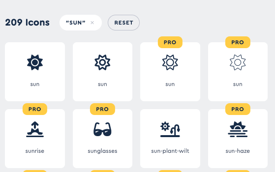
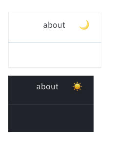
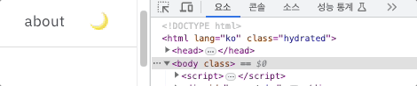

## 다크모드
다크모드를 적용해봤습니다. 원래 향후 계획에도 없던 ... 기능인데 너무 하얘가지고 가만히 보고 있자니 가끔 눈이 아파서 이참에 구현을 해봤습니다.
다크모드를 한 번도 구현해본적은 없지만 막연하게 그냥 전역으로 변수 두고 스타일 변수만 바꿔주면 되겠지 ... 했는데 생각보다 고려사항이 많았습니다. 게다가 서버 사이드 랜더링은 처음이라 더 어려웠던 것 같습니다. 여러 포스팅들을 읽고 읽으면서 제일 이해가 쉬운 방법으로 따라해봤습니다.

## 1. 버튼 만들기
먼저 버튼을 만들어 줬습니다. 버튼은 그냥 간단하게 해와 달 아이콘으로 표현을 해봤습니다.
처음에는 폰트어썸을 사용했는데 돈을 내지 않고서는



앞에 두 개 아이콘 밖에 사용할 수가 없었는데 뭔 톱니바퀴 같기도하고 하여간 너무 맘에 안들어서 그냥 이모지로 표현을 해버렸습니다.



사실 이것도 100% 마음에 들지 않아 언젠가 다시 바뀔지도 모를 것 같습니다.

## 2. 다크모드 설정하기
이제 사용자 설정 혹은 시스템의 설정에 따라 다크모드를 설정해줍니다. 다크모드 설정 방식은 다음과 같은 방식으로 진행을 했습니다.

먼저 다크모드로 설정하고 싶다면 body에 'dark'라는 클래스를 추가해줍니다. 그리고 글로벌 스타일에서 기본 스타일과 다크모드 스타일을 각각 정의 해준 뒤, body 클래스에 따라 다른 스타일 선택해줍니다.
이 때 기본 스타일과 다크모드 스타일에서는 css변수를 다르게 사용해줬는데 키값은 동일하게 지정하되 해당 키값에 대한 색상 값을 다르게 주는 방식으로 하여 하위 스타일에서 같은 변수명을 사용하더라도 모드에 따라 다른 색이 적용되도록 했습니다.

예를 들어 `--background-color` 값을 기본 스타일에서는 white, 다크모드 스타일에서는 black으로 설정하고 해당 변수 값을 body의 배경 색상으로 지정해주면, 모드에 따라 다른 색상이 적용되는 방식입니다.

이를 위해서 먼저 다크모드일 경우 body에 'dark' 클래스를 추가해주는 작업을 먼저 진행했습니다.

### 시스템 설정에 따라 다크모드 설정
요즘 많은 시스템들이 다크모드를 지원해주고 있습니다. 그에 따라 웹에서도 prefers-color-scheme 라는 미디어 속성으로 시스템의 다크 테마 여부를 탐지할 수 있게 되었습니다.

`prefers-color-scheme`라는 미디어 속성을 사용하면 다크 테마 여부를 감지할 수 있는데 다음과 같이 사용할 수 있습니다.

```css
@media (prefers-color-scheme: dark) {
  body {
    background: black;
    color: white;
  }
}
```

이런 식으로 사용해주면 시스템의 다크모드 설정에 따라 다른 스타일을 제공해줄 수 있습니다.

물론 시스템의 설정도 중요하지만 사용자가 설정을 변경한다면 사용자의 설정을 따라가야 합니다. 이렇게 사용자의 설정과 시스템의 설정을 모두 고려하기 위해서는 스크립트로 사용을 해야하는데, 미디어쿼리를 스크립트로 처리하기 위해서는 matchMedia 를 사용할 수 있습니다.

`window.matchMedia`는 주어진 미디어 쿼리 문자열의 분석 결과를 나타냅니다. 이 함수는 `MediaQueryList` 를 반환하는데 이 객체는 media와 matches라는 두 프로퍼티가 존재합니다. media는 사용한 미디어쿼리 문자열을 반환하고, matches는 현재 화면이 미디어 쿼리의 범위에 들어가면 true, 아니면 false를 반환합니다.

```javascript
const darkQuery = window.matchMedia('(prefers-color-scheme: dark)');
console.log(darkQuery.matches ? 'dark' : 'light');
```

이렇게 사용할 수 있습니다.

또 하나 고려해야할 부분은 시스템이나 사용자의 설정을 기억해야 한다는 점입니다.
다시 방문 했을때에도 이전의 설정을 기억하여 그대로 제공하도록 해주는 기능이 필요합니다. 다시 방문했을때는 다시 설정하면 되지 라는 생각을 잠시 했지만 문제는 새로고침입니다. 이렇게만 한다면 새로고침 시 설정이 초기화되어... 굉장히 무능한 블로그 같고 .. 하여튼 불편합니다. 이를 위해서는 localStorage를 사용하여 브라우저에 마지막으로 설정한 모드를 저장해줬습니다.

이를 종합하여 시스템 설정에 따라서 body 클래스에 'dark'를 추가하거나 제거해주기 위해서는 다음과 같이 할 수 있습니다.

```javascript
const DARK = 'dark';
const LIGHT = 'light';
// 시스템 설정이 다크모드인지 확인
const darkQuery = window.matchMedia('(prefers-color-scheme: dark)');

// localStorage에 저장된 테마 불러오기
const savedTheme = localStorage.getItem('theme');
// 다크모드라면 theme를 dark로, 아니라면 light로 설정하고 theme에 따라 클래스 변경
const newTheme = savedTheme || (darkQuery.matches ? DARK : LIGHT);

const setTheme = (DARK) => {
  if (newTheme === 'dark') {
    document.body.classList.add('dark');
  } else {
    document.body.classList.remove('dark');
  }
  // 새로 설정된 테마를 localStorage에 저장 
  localStorage.setItem('theme', newTheme);
};
// 동적으로 시스템 테마 변경에 따라 바뀌도록 하려면 미디어 쿼리 state 변경에 따라 변경될 수 있도록 이벤트 리스너를 넣어줄 수 있다.
darkQuery.addListener((e) => {
  setTheme(e.matches ? 'dark' : 'light');
});
```

이제 이 스크립트를 어디서 실행하는지가 문제입니다.

이게 적용하기 까다로운 이유가 해당 속성이 css 속성이기 때문에 server 에서 받아올 수 없어서 그냥 react의 lifecycle 내에서 현재 테마를 가져오고, 그에 따라 스타일을 조정하면 시스템이 다크 테마여도 잠시 라이트 테마가 보여지는 현상을 겪을 수 있다고 합니다.

이 문제를 해결하기 위해서는 위 스크립트가 화면이 painting 되기 전에 실행되어야 합니다. 제가 참고한 포스팅에서는 스크립트를 body 바로 다음에 위치시켜서 body 내부 엘리먼트들이 페인팅 되기 전에 실행하도록 하였습니다. 이렇게 두면 스크립트는 DOM 파싱을 막으므로, 위 스크립트가 실행된 후에 페인팅이 되는 것이 보장되기 때문입니다.

Gatsby에서는 gatsby-ssr의 onRenderBody API를 이용할 수 있습니다. 해당 API는 setPreBodyComponents 함수를 제공하는데, 이 함수를 통해 body 바로 하위에 스크립트를 넣어줄 수 있습니다.
(아니면 html.js를 수정할 수 있는데, Gatsby Theme 내에서는 제공이 안되어 권장하지는 않는다고 합니다.)

결과적으로 gatsby-ssr.js 파일에 다음과 같이 적용해주면 됩니다.

```javascript
const React = require('react');

exports.onRenderBody = ({ setPreBodyComponents, setHtmlAttributes }) => {
  const script = `
    const DARK = 'dark';
    const LIGHT = 'light';
    
    const darkQuery = window.matchMedia('(prefers-color-scheme: dark)');
    const savedTheme = localStorage.getItem('theme');
    
    const newTheme = savedTheme || (darkQuery.matches ? DARK : LIGHT);

    const setTheme = (DARK) => {
    if (newTheme === 'dark') {
        document.body.classList.add('dark');
    } else {
        document.body.classList.remove('dark');
    }
    localStorage.setItem('theme', newTheme);
    };
    
    darkQuery.addListener((e) => {
    setTheme(e.matches ? 'dark' : 'light');
    });
  `;
  setHtmlAttributes({ lang: `ko` });
  setPreBodyComponents(<script dangerouslySetInnerHTML={{ __html: script }} />);
}

```
<br/>

### 사용자 설정에 따라 다크모드 설정

아까 만들어 둔 버튼을 연동하여 사용자 설정에 따라서도 다크모드가 설정될 수 있도록 만들어야 합니다. 먼저 버튼에서 해당 스크립트의 함수 및 값을 사용할 수 있도록 window 객체에 넣어줍니다.

```javascript
const React = require('react');

exports.onRenderBody = ({ setPreBodyComponents, setHtmlAttributes }) => {
  const script = `
  window.__DARK = 'dark';
  window.__LIGHT = 'light';
  
  const darkQuery = window.matchMedia('(prefers-color-scheme: dark)');
  const savedTheme = localStorage.getItem('theme');

  window.__theme = savedTheme || (darkQuery.matches ? window.__DARK : window.__LIGHT);

  window.__setTheme = (newTheme) => {
    if (newTheme === window.__DARK) {
      document.body.classList.add(window.__DARK);
    } else {
      document.body.classList.remove(window.__DARK);
    }
    localStorage.setItem('theme', newTheme);
  };

  darkQuery.addListener((e) => {
    window.__setTheme(e.matches ? window.__DARK : window.__LIGHT);
  });

  window.__setTheme(window.__theme);
  `;
  setHtmlAttributes({ lang: `ko` });
  setPreBodyComponents(<script dangerouslySetInnerHTML={{ __html: script }} />);
}
```

그리고 다크모드 버튼을 클릭하면 window객체에 저장해둔 `__setTheme` 함수를 호출하도록 코드를 작성합니다. 

```javascript
const Layout = ({ location, title, children }) => {
    ...
	const [theme, setTheme] = useState(null);
	
	let isDarkMode = false;
	if (typeof window !== 'undefined')  
		isDarkMode = theme === window.__DARK;

	const onClickDarkModeButton = useCallback(() => {
		if (typeof window !== 'undefined')  {
			const newTheme = isDarkMode ? window.__LIGHT : window.__DARK;
			window.__setTheme(newTheme);
			setTheme(newTheme);
		}
	}, [isDarkMode]);

	useEffect(() => {
		setTheme(window.__theme);
	}, []);

	if (!theme) {
		return null;
	}

	return (
        ...
		<DarkModeButton onClick={onClickDarkModeButton}>{isDarkMode ? '☀️' : '🌙'}</DarkModeButton>
        ...
	);
};

```

이렇게 하면 다크모드 버튼을 클릭할 때 마다 body요소에 'dark'클래스가 생겼다 사라졌다 하는 것을 확인할 수 있습니다.




### 다크모드에 따라 스타일 설정하기
이제 다크모드에 따른 스타일만 적용해주면 됩니다. 사실 다크모드와 라이트모드에서의 차이점은 색상밖에 없기 떄문에 색상만 잘 설정해주면 됩니다.
이 부분은 GPT의 도움을 받았습니다. 제 블로그는 CSS-in-JS라이브러리로 emotion을 사용하고 있는데 글로벌 스타일을 적용할 때 body 요소에 'dark'클래스가 있는지에 따라 다른 스타일을 적용해주는 방법을 사용했습니다.

```javascript
import React from 'react';
import { Global, css } from '@emotion/react';
import Common from './common';

// 기본 스타일
const baseStyle = css`
  /* ... 기본 스타일 ... */
`;

// 다크 모드 스타일
const darkStyle = css`
  /* ... 다크 모드 스타일 ... */
`;

const GlobalStyle = () => {
  // body 클래스에 따라 다른 스타일 선택
  const currentStyle = css`
    ${baseStyle};
    ${document.body.classList.contains('dark') ? darkStyle : null};
  `;

  return <Global styles={currentStyle} />;
};

export default GlobalStyle;
```

이렇게 해주고 다크모드 스타일에 기본 스타일의 색상변수를 다시 설정해주면 됩니다. 

```javascript
// 기본 스타일
const baseStyle = css`
    ...
    --color-text: black;
    --color-background: white;
`;

// 다크 모드 스타일
const darkStyle = css`
    --color-text: white;
    --color-background: black;
`;
```
<br/>
그런데 아뿔싸 ... emotion을 적용하면서 css 변수를 common이라는 자바스크립트 파일을 만들고 그 파일 내에서 객체로 관리하도록 바꾸는 바람에 저 방식이 통하지 않아서 고민을 좀 했습니다.

고민 결과 Common 객체에 lightColor, darkColor를 속성으로 두고, 그 속성 하위에 색상을 정의해두기로 했습니다.

```javascript
const Common = {
	...
	lightColor: {
		text: 'black',
		background: 'white',
	},
	darkColor: {
		text: 'white',
		background: 'black',
	},
    ...
};
  
export default Common;
```

<br/>
그리고 이걸 다시 css변수로 적어줬습니다.

```javascript
// 기본 스타일
const baseStyle = css`
    ...
    --color-text: ${Common.lightColor.text};
    --color-background: ${Common.lightColor.background};
`;

// 다크 모드 스타일
const darkStyle = css`
    --color-text: ${Common.darkColor.text};
    --color-background: ${Common.darkColor.background};
`;
```
<br/>
뭔가 Common 객체로 전역적인 스타일을 한 번에 관리할 수 있는 점이 편리하지만 색상을 추가할 때 css변수로 한 번 더 추가해야 하는 번거로움과 다른 스타일은 Common객체에서 가져다 쓰는 반면 색상은 css 변수를 사용해야 한다는 점이 통일성을 해치는 기분이라 만족스럽지 못합니다. 이 부분에 대해서는 조언이 필요할 것 같습니다... 도와주세요 
<br/>

## 3. giscus(댓글)에 다크모드 설정하기
헐 이렇게 하니까 다른 부분에는 다크모드가 잘 적용이 되지만 댓글에는 다크모드가 적용이 안돼서 둥둥 떠다닙니다. 댓글에도 다크모드를 설정해줘야 하는데 giscus를 가져다 쓰는 입장에서 어떻게 적용해야 하는지 생각해보니 giscus에서는 다양한 테마를 적용하고 있습니다. 그래서 다크모드 여부에 따라 테마가 변경되도록 구현을 해봤습니다.

먼저 댓글 컴포넌트에서 테마가 바뀌었다는 것을 감지할 수 있도록 window객체에 리스너를 등록할 수 있도록 바꿔줍니다.

```javascript
const React = require('react');

exports.onRenderBody = ({ setPreBodyComponents, setHtmlAttributes }) => {
  const script = `
  window.__DARK = 'dark';
  window.__LIGHT = 'light';
  
  const darkQuery = window.matchMedia('(prefers-color-scheme: dark)');
  const savedTheme = localStorage.getItem('theme');

  window.__theme = savedTheme || (darkQuery.matches ? window.__DARK : window.__LIGHT);
  window.__onThemeChange = () => {};

  window.__setTheme = (newTheme) => {
    if (newTheme === window.__DARK) {
      document.body.classList.add(window.__DARK);
    } else {
      document.body.classList.remove(window.__DARK);
    }
    localStorage.setItem('theme', newTheme);
    window.__onThemeChange(newTheme);
  };
  darkQuery.addListener((e) => {
    window.__setTheme(e.matches ? window.__DARK : window.__LIGHT);
  });

  window.__setTheme(window.__theme);
  `;
  setHtmlAttributes({ lang: `ko` });
  setPreBodyComponents(<script dangerouslySetInnerHTML={{ __html: script }} />);
}
```
<br/>
이렇게 테마가 변경될 때 마다 window.__onThemeChange() 함수가 호출되도록 작성해줍니다.
그 다음 댓글 컴포넌트에서 window.__onThemeChange() 함수를 등록해주면 됩니다. 여기서는 __onThemeChange() 함수 내부에서 댓글 테마가 바뀌도록 하여 전체 테마가 바뀔 때 마다 댓글 테마도 바뀌도록 해줬습니다.

```javascript
const [commentTheme, setCommentTheme] = useState(null);

useEffect(() => {
	if (typeof window !== 'undefined')  {
		setCommentTheme(window.__theme === window.__DARK ? 'dark' : 'preferred_color_scheme');
		window.__onThemeChange = (theme) => {
			setCommentTheme(theme === window.__DARK ? 'dark' : 'preferred_color_scheme');
		};
	}
}, []);

if (!commentTheme) {
	return null;
}
```

여기까지 해서 다크모드 적용을 완료하였고 전체적으로 [이 블로그](https://godsenal.com/posts/gatsby-%EB%B8%94%EB%A1%9C%EA%B7%B8-%EB%8B%A4%ED%81%AC-%ED%85%8C%EB%A7%88-%EC%A0%81%EC%9A%A9%ED%95%98%EA%B8%B0)를 많이 참고하여 진행을 했습니다.


## 향후 계획 점검
일단 TOC를 구현은 했지만.. 분명 잘 되는 걸 확인하고 배포했는데 고장이 나서 링크가 작동하고 있지 않습니다. 이건 최대한 빨리 고쳐볼 예정입니다. 그리고 나머지 사항은 아직 진행할 생각이 없고 ... 그 동안은 자잘한 디자인을 수정하고 코드 리팩토링을 했습니다. 그 과정에서 컴포넌트를 분리하고 css-in-js 라이브러리로 emotion을 적용하여 스타일을 관리하도록 수정했습니다. 이제 또 수정하고 싶은 사항은 ...코드 블럭이 예쁘긴한데 줄바꿈도 때문인지 가독성이 전혀 없고 inline 코드 블럭이 너무 못생겨서 이것도 수정할 예정입니다. 자잘한 수정 사항은 그냥 수정만 하고 넘기겠지만 다크모드나 TOC 처럼 제 기준 조금 작업이 필요한 사항을 또 개발하거나 수정한다면 포스팅을 작성하겠습니다!!