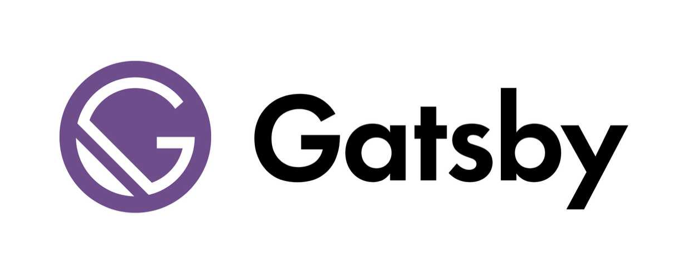
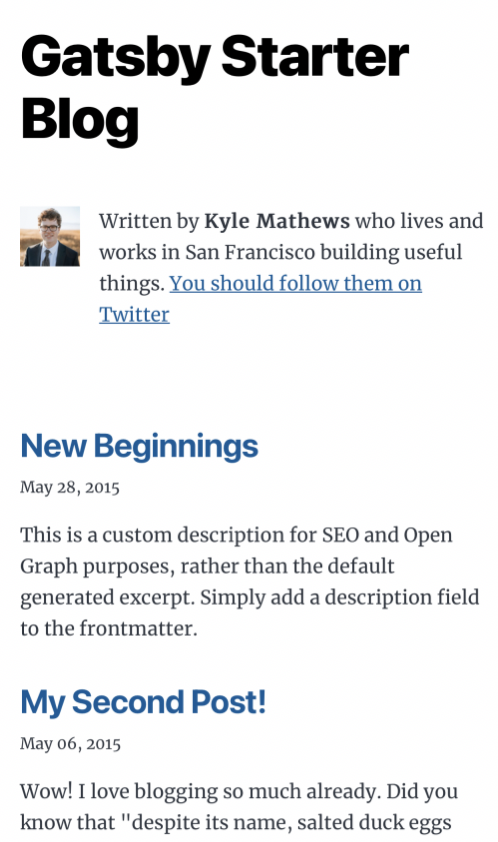
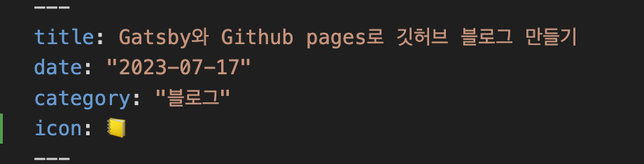
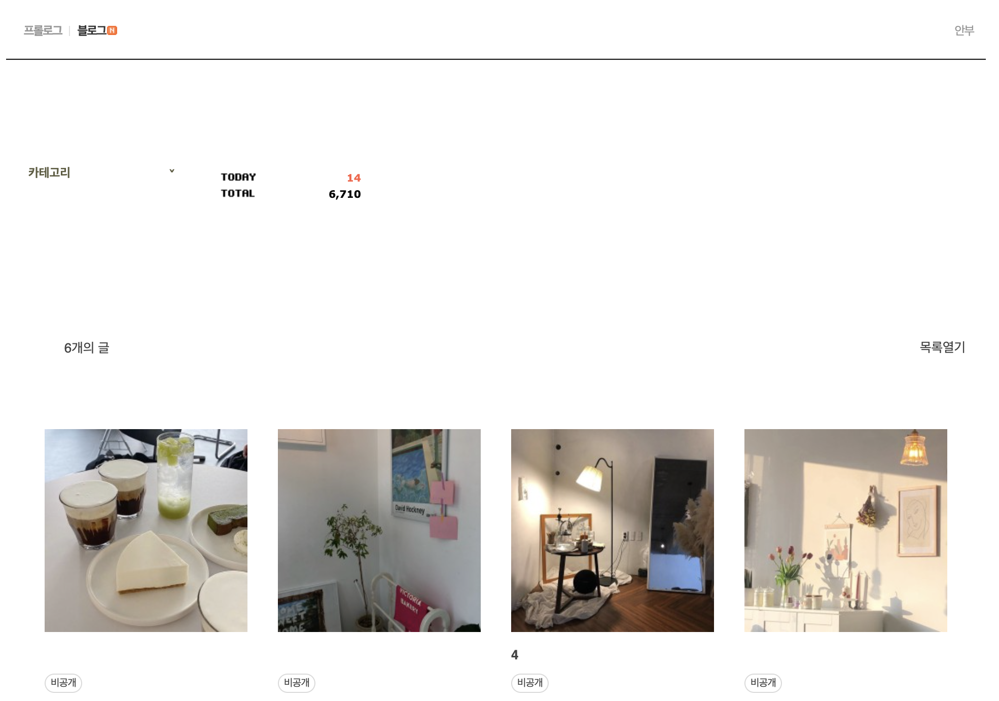
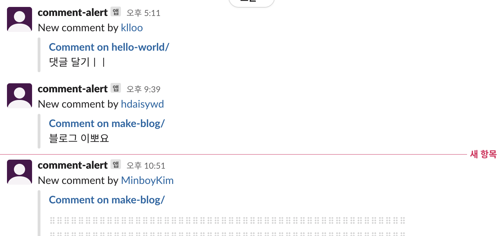
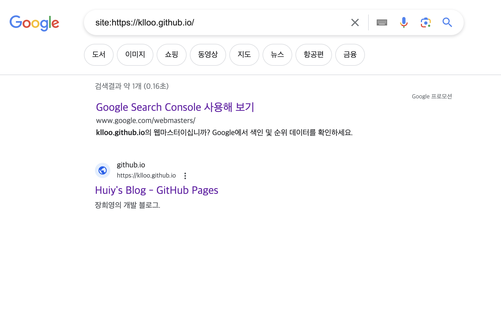

내 나이 26 ... 드디어 깃허브 블로그를 만들다...


#### 계기
이전에도 기술 블로그를 운영하려는 노력은 꾸준히 해왔다.
맨 처음 마음 먹었을 때는 네이버 블로그를 사용했다. 당시 대학교 4학년이었지만 아무것도 모르던 나는... 그냥 접근성이 제일 좋아서 네이버 블로그로 선택을 했었다.

스프링으로 막 백엔드 공부를 시작하면서 혼자 진행했던 프로젝트 내용, 알고리즘 문제 풀이, 정보처리기사 공부했던 내용, 면접 대비용으로 자바와 CS공부했던 내용 등을 정리해놨었다. 이제보니 나름 뭘 많이 끄적여놨는지...게시글이 116개가 있다.

그런데 왐마?! 뭔가 좀 이것 저것 찾아보기 시작하면서 아무도 네이버 블로그를 기술 블로그로 사용하지 않는다는 것을 깨달았다. 또 그 때가 막 네이버 블로그에 일상을 기록하고 소통하는게 유행하기 시작하던 때라...나도 그냥 공부했던 내용 전부 비공개로 전환해놓고 일상 블로그로 돌려버렸다^_^

그리고는 취업을 했는데 자바스크립트와 클라우드에 관련한 지식 부족으로 ... 업무를 하는데 어려움을 겪었었다. 그래서 공부를 시작하기로 마음 먹고 이 참에 기술 블로그도 다시 해봐야겠다고 생각했다. 그 때는 벨로그를 사용했는데 내 기준 제일 깔끔하고 가독성이 좋아서 선택했었다. 벨로그 메인 트렌드 탭에 올라오는 글들을 읽어보는 것도 재밌었다. 나도 재밌는 글 많이써야지 하고 야심차게 시작을 했는데...

주로 개념 정리를 하다보니 그냥 여기저기서 긁어온 내용을 누덕누덕 기운 누더기 포스팅만 잔뜩 생겼었다. 당연히 궁금했던 내용, 알아야하는 내용을 찾아보고 이해한 내용을 정리하면서 큰 도움이 됐고 아직도 필요할 때 마다 정리했던 내용을 찾아보기도 하지만 이런걸 꼭 블로그에 써야하나? 하는 생각이 들었다. 그래서 그냥 다 노션으로 옮겨놓고, 앞으로는 이렇게 개념 정리나 혼자 공부한 내용은 노션에 작성을 하고, 프로젝트를 진행하는 과정이나 하여튼 뭔가 혼자 생각해보고 혼자 해결한 과정 같은 것들은 블로그에 기록해두고 싶었다.


나 스스로도 왜 이제 와서... 라는 생각이 들었지만 몰라... 고민 말고 다시 시작해보기로 했다.
왜 깃허브 블로그로 다시 시작을 했냐면 그냥 멋져서 그렇다.


#### 플랫폼 선정


보통 깃허브로 블로그를 만들 때 제일 유명한게 Jekyll과 Gatsby였는데 Gatsby가 리액트 기반이라고 해서 관심이 갔다. 안그래도 막막한 블로그 만들기... 조금이라도 익숙한 환경에서 진행을 해보고 싶었다.

그래서 관련된 내용을 찾아보니 Gatsby가 유용한 플러그인들도 많이 제공을 하고, 성능도 더 좋다고 하길래 더 고민없이 Gatsby로 선택했다! Jekyll은 사용해보지 않아서 비교는 못해보겠지만 확실히 리액트 기반이라 큰 어려움 없이 진행할 수 있었던 것 같다. 아직 SSG에 대한 내용이나 Gatsby프레임워크, GraphQL을 몰라서 반도 모르고 사용한 느낌이라 이 부분들에 대해서도 더 찾아봐야할 것 같다.

#### 깃허브 페이지로 블로그 올리기
먼저 틀만 만들어진 블로그를 Github Pages로 올려보고 싶었다.

**1. Gatsby 프로젝트 생성**

**2. Github Repository를 생성하고 Gatsby 프로젝트와 연결**

**3. Github Pages 설치 및 배포 설정**

그 과정은 이 순서로 진행을 했다. Gatsby는 리액트 프레임워크로 SSG(Static Site Generator, 정적 사이트 생성기)이다. 여기서 정적 사이트란 HTML, CSS, JavaScript로만 만들어진 사이트를 의미한다. 

그래서 이걸로 어떻게 블로그를 만드는거냐면 내가 Markdown으로 글을 쓰면, 이걸 SSG가 HTML코드로 변환을 해서 정적 사이트로 만들어 주는데, 이 만들어진 정적 사이트를 블로그로 사용하는 것이다. 이렇게 하면 정적 파일만 배포하면 되기 때문에 별도의 서버를 운영할 필요가 없다는 장점이 있다.

아무튼 이렇게 블로그를 만들었으니, 배포를 해야하는데 이 때 사용하는 것이 Github Pages이다. Github pages는 github에서 제공하는 정적 웹사이트 호스팅 서비스로, 자신의 repository내용으로 웹페이지를 구동할 수 있게 해준다.

자세한 진행 과정은 [이 블로그](https://devfoxstar.github.io/web/github-pages-gatsby)를 보고 진행하였다.



처음엔 이런 모습이었다.(모바일 화면) 저 kyle mathews라는 분이 Gatsby 만든 사람이라고 한다... 안녕하세요 대단하십니다.


#### 블로그 디자인 및 기능 추가
깃허브 블로그의 가장 큰 장점은 모든걸 커스터마이징할 수 있다는 것이다. 깃허브 블로그를 선택한 이유가 멋있어서... 라고 했는데 이 점이 제일 멋있는 것 같다.

먼저 원했던 기능들을 추가한 다음, 디자인을 추가했다.

##### 카테고리 기능

카테고리 추가는 그냥 마크다운 문서 가장 위쪽에 있는 메타데이터를  `frontmatter` 라고 하는데 그냥 여기에 category 항목만 추가하면 됐다.



그리고 이걸 활용해서 카테고리 목록을 가져왔다. graphql 초면이라 이 부분은 구글링 했다.

```graphql
categories: allMarkdownRemark(limit: 2000) {
    group(field: frontmatter___category) {
        fieldValue
        totalCount
    }
}
```

아무튼 이렇게 가져와서

    
```js
const categories = [{fieldValue: ALL_NAME, totalCount: allPosts.length}, ...data.categories.group]
```

이렇게 전체보기 카테고리까지 추가한 다음 화면에 뿌려줬다.

그 다음 카테고리를 선택하면 페이지 전환 없이 그냥 포스트 목록에서 제목에 검색 키워드가 포함되는 포스트만 조회되도록 하고싶었다. 이 부분은 따로 질의 하지 않고 그냥 전체 포스트 목록에서 걸러주는 식으로 만들었다.

```js
useEffect(() => {
  if (curCategory === ALL_NAME) {
    setPosts([...allPosts]);
    return;
  } setPosts([...allPosts.filter((post)=>post.frontmatter.category === curCategory)]);
}, [curCategory]);
```

이렇게 카테고리가 바뀔 때 마다 다른 포스트들을 보여주도록 했다.

##### 검색 기능

검색도 카테고리와 마찬가지로 전체 포스트 목록에서 키워드로 걸러주는 방식으로 만들었다.

```js
  const searchProc = useCallback((e) => {
    e.preventDefault();
    // 검색 키워드가 없으면 전체보기 카테고리로 이동
    if(!keyword || !keyword.trim()) {
      setCurCategory(ALL_NAME);
      setPosts([...allPosts]);
      return;
    }
    setPosts([...allPosts.filter((post)=> {
      // 키워드가 포스팅의 제목 또는 설명에 포함이 되어야 하고 현재 카테고리가 전체보기거나, 전체보기가 아니라면 해당 카테고리에 속하는 게시글이어야 한다. (카테고리 별로 검색)
      if ((post.frontmatter.title?.includes(keyword) || post.frontmatter.description?.includes(keyword))) {
        if (curCategory !== ALL_NAME) 
          return post.frontmatter.category === curCategory;
        return true;
      }
  })])
  }, [keyword, curCategory]);
```

이렇게... 했어욥

대충 이 정도만 추가하고 본격적으로 꾸미기 시작했다. 일단 나는 최대한 심플하고 깔끔하게 만들고 싶었다.



이게 내 네이버 블로그인데 뭔가 이런 느낌으로 만들고 싶었다. 뭐... 아무것도 없어보이긴 하지만 그래도 있을 기능 다 있고도 엄청 깔끔한 점이 맘에 든다.

그리고 [이 블로그](https://zoomkoding.com/college-timetable-development/)도 많이 참고했다.
사실 거의 그대로 만든 느낌인데 개인적으로 카드 형태의 목록을 좋아해서 포스트 목록은 카드 형식으로 만들었다!

제일 많이 신경 쓴 부분은 폰트인데 폰트는 [ibm 폰트](https://noonnu.cc/font_page/448)를 사용했다.
처음에는 [paybook 폰트](https://noonnu.cc/font_page/452)를 사용했었는데 적당히 둥글고도 단정한 느낌이 좋았지만 ibm폰트가 더 깔끔하고 가독성이 좋은 느낌이라 이걸로 결정했다! 하지만 언제 또 바뀔지 모른다.. 결정느림보에게 이렇게 자유도 높은 플랫폼은 힘들어요... 


#### 댓글 추가하기
무릇 블로그라면 댓글 기능이 있어야한다.

보통 Utterances를 많이 사용하는 것 같은데 나는 giscus라는 것을 사용했다. 테마도 다양했고 반응 기능, 정렬 기능, 답글 기능 등 Utterances보다 많은 기능을 제공하고 있었기 때문이다!

giscus는 일단 댓글 전용 리포지토리를 만들고, Discussions를 활성화 시킨 다음, [이 문서](https://giscus.app/ko)에 나온대로 진행하면 된다. 댓글 기능은 포스트 별로 discussion을 생성하고, 해당 discuusion에 달린 댓글을 포스트에 보여주는 방식인 것 같았다.

이 문서의 마지막에 페이지에 넣으라고 스크립트를 제공해주는데 이걸 어떻게 적용시키지...? 싶었다. 그래서 찾아보니 `@giscus/react` 라는 패키지가 있었다. 이 패키지를 설치하고 [여기서](https://github.com/giscus/giscus-component) 하라는대로 컴포넌트를 추가해줬다!

```html
<Giscus
    id="comments"
    repo="klloo/blog-comments"
    repoId=""
    category=""
    categoryId=""
    mapping="pathname"
    strict="0"
    reactionsEnabled="1"
    emitMetadata="0"
    inputPosition="bottom"
    theme="preferred_color_scheme"
    lang="ko"
    crossorigin="anonymous"
    async
/>
```

giscus에서 제공해주는 스크립트의 속성명(케밥케이스)과 컴포넌트에 넣어야하는 prop이름(카멜케이스)이 다르기 때문에 주의해야 한다. 이 사항은 `@giscus/react` 패키지 설명에도 나와있긴하다.

그러면 댓글 기능 완성이다. 그런데 이렇게만 하면 내가 포스트들을 일일이 확인해야 댓글이 달렸는지 알 수 있다. 그래서 댓글이 달리면 슬랙으로 알림이 오도록 설정해줬다.

먼저 슬랙에 워크스페이스를 만들고 슬랙 봇을 생성해준다. 그리고 댓글 전용 repository에 Actions를 추가해준다. 그럼 끝이다 

github actions는 github에서 제공하는 CI/CD를 위해 제공되는 서비스로 repository에서 에서 어떤 이벤트가 발생했을 때 특정 작업이 일어나게 하거나 주기적으로 어떤 작업들을 반복해서 실행시킬 수도 있다. 그래서 댓글이 달리면(discussion이 생성되거나, discussion에 댓글이 달렸을 경우), 슬랙으로 알림을 보낼 수 있도록 설정해주면 되는 것이다.



자세한 과정은 [이 블로그](https://jjam89.tistory.com/287)를 참고했고, 이렇게 해주면 슬랙으로 알림이 잘 오는걸 확인할 수 있다!

#### Google Search Console 등록하기
이렇게 블로그도 만들고 댓글 기능도 만들었는데 아무도 안찾아오면 외롭고 슬프니까 Google Search Console에 등록해준다.

이 과정은 Gatsby 플러그인을 사용해서 robots.txt과 sitemap을 생성하고, Google Search Console에 sitemap을 등록해주기만 하면 된다.

등록하는 과정은 [이 블로그](https://janeljs.github.io/blog/google-search-console/) 내용을 참고하였다. 일단 따라서 등록은 했는데... 잘 된건지 모르겠다. 보통 노출되는데 며칠 걸린다고 하니까 좀 기다려봐야겠다

 \+ 하루만에 노출이 되고 있는 것을 확인했다!
 
 

#### 향후 계획
**1. about 페이지 추가**
<br/>
우측 상단에 버튼만 덩그러니 만들어 놨는데... 당장은 안할 것 같지만 언젠가 나에 대한 내용으로 차차 채워 볼 예정이다.

**2. 페이징 기능 추가**
<br/>
게시글이 많아진다면 페이징 기능도 추가해봐야할 것 같다.

**3. 블로그 홈 배너 위치에 있는 내용 수정**
<br/>
뭐 넣어야할 지 몰라서 일단 갤러리 뒤져서 아무 사진이나 넣어뒀는데 나쁘지 않길래 그냥 뒀다. 좋은 아이디어가 떠오르면 바로 수정할 예정이다.

**4. SEO 최적화**
<br/>
아직 검색엔진과 검색엔진 최적화에 대한 개념이 많이 부족하기도 하고 작성한 글도 없으니...일단은 미뤄두지만 조만간 공부해보고 적용해볼 예정이다.

**5. 게시물 목차(TOC) 구현**
<br/>
그 보통 개발 블로그 보면 게시물 옆에 졸졸 따라다니는 목차가 있는데 나도 필요할 것 같다. 이건 이번주 안에 추가할 예정이다.
